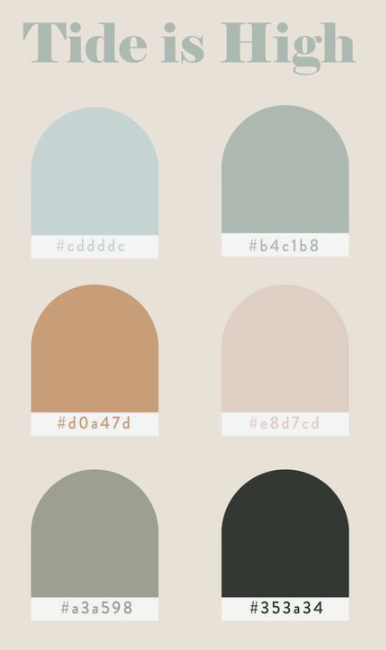

# Color palette

This project is the first of a series of HTML and CSS exercises suggested by [csbatista](https://github.com/csbatista) in order for me to improve my coding skills

## Scope

The exercise consists in reproduce the image below and change the page so that when you hover over a color block, the shape with the color becomes a circle

**You can find the final project** [here](https://dadaniela.github.io/color-palette/)
